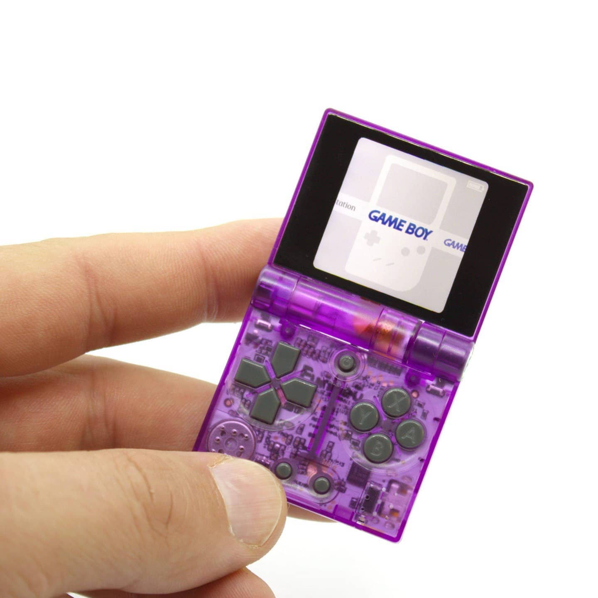

# Welcome to FunKey!

{: align=left }

Thank you for choosing the **FunKey S**!

The **FunKey S** is the world's smallest foldable retro-gaming
console.

Because of its foldable design, the **FunKey S** provides a
surprisingly large screen and comfortable key pads while open, but it
stays compatible with a keychain usage when closed.

## Basic operation

The **FunKey S** operation is so straightforward that a 6-year old
child should be able to operate it without any user's manual for the
most common tasks. But just to make sure you are not missing
something, you can find the basic device operation description in the
[Quickstart section][1].

## More advanced features

Despite its size, the **FunKey S** is packed with features, and this
documentation will also provide more advanced tips in the [Tutorials
section][2].

## Developers

For developers, a full [Developer's Guide][3] is included, with both
[Hardware][3] and [Software][4] subsections.

## Miscellaenous stuff

Last but not least, this documentation would not be complete without a
[Glossary of terms][5] and an [FAQ][6] section for reference.

[1]: quickstart.md
[2]: tutorials/software/firmware_update.md
[3]: developers/hardware_reference/
[4]: developers/software_reference/sd_card_layout/recovery_partition.md
[e5]: miscellaneous/glossary.md
[6]: miscellaneous/faq.md

--8<--
includes/glossary.md
--8<--
